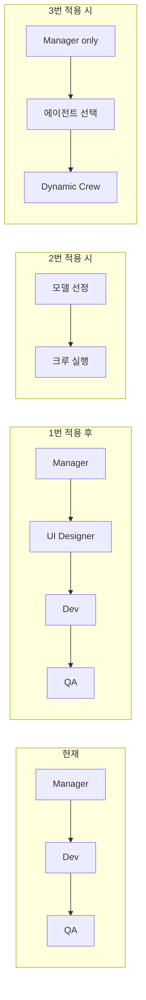

# 프로세스 강화 아이디어: 조건·난이도·우선순위

에이전트 팀(매니저·개발·QA) 프로세스를 강화하기 위한 계획.  
UI 퍼블리셔 추가, Manager 기반 LLM·에이전트 선정, 미래 계획(이슈 단위 병렬 처리)을 정리한다.

**참조**: [docs/agent-convention.md](../agent-convention.md) — docs/plan, docs/skill, docs/issues 사용 규칙.

---

## 현재 구조 요약

- **진입점**: [main.py](../../main.py) — 고정 3에이전트(매니저→개발→QA), 고정 3태스크, `Process.sequential`.
- **LLM**: [agents/agents.py](../../agents/agents.py) — 전역 단일 `LLM(model="openai/gpt-4o")`.

---

## CrewAI: 고정 순차만 가능한가?

**아니다.** CrewAI는 다음을 지원한다.

- **Process.sequential**: 태스크를 미리 정한 순서대로 실행(현재 사용 중).
- **Process.hierarchical**: 매니저 에이전트가 태스크를 **역할/역량에 맞게 위임**하고 결과를 검증한다. `manager_llm` 또는 `manager_agent`를 지정하면 매니저가 에이전트 풀 중 누가 어떤 태스크를 할지 결정한다.
- **ConditionalTask**: 이전 태스크 출력에 대한 조건 함수(True/False)로 해당 태스크를 **실행할지 스킵할지** 동적으로 결정한다.

"필요한 에이전트만 호출"은 (1) 직접 2단계(매니저 → 동적 크루)로 구현하거나, (2) **Process.hierarchical**로 매니저에게 위임·검증을 맡기는 방식으로 구현할 수 있다. 팀의 "매니저가 스펙 작성 + 댓글 필수" 같은 기존 규칙을 유지하려면 2단계가 더 명시적일 수 있고, Crew 네이티브만 쓰려면 hierarchical 검토가 유리하다.

---

## 1. 에이전트 추가: 아주르(Azure) — UI Designer → UI 퍼블리셔

### 실현 조건

- **역할·태스크 정의**: UI Designer의 role, goal, backstory 및 전용 태스크(예: 매니저 스펙을 바탕으로 UI/UX 가이드·와이어프레임·디자인 스펙 작성). Figma MCP 연동 시 **UI 퍼블리셔** 역할로, 매니저 스펙 + Figma 컨텍스트 → UI 스펙·퍼블리싱 가이드 작성.
- **실행 순서**: 매니저 직후·개발 직전. [tasks/tasks.py](../../tasks/tasks.py)에 `create_ui_design_task`(또는 `create_ui_publisher_task`) 추가, [main.py](../../main.py)의 tasks/agents 리스트에 삽입.
- **툴**: GitHub 이슈/파일 읽기·댓글 작성. (Figma MCP 래퍼는 선택.)
- **검증·대시보드**: [main.py](../../main.py)의 `AGENT_HEADERS`에 UI Designer/퍼블리셔 헤더 추가. [dashboard_state.py](../../dashboard_state.py)는 크루 agents만 갱신하면 자동 반영.
- **문서**: [README.md](../../README.md), [docs/agent-convention.md](../agent-convention.md)에 역할 보강.

### 난이도

**낮음~중간.** Figma/Stitch MCP 연동 시 **중간**. UI 역할은 **UI 퍼블리셔**(Figma MCP 연동 권장)로 두는 것이 실효적.

---

## 2. Manager가 판단하여 알맞은 LLM 모델 선정 (OpenAI 한정)

### 실현 조건

- **OpenAI 한정**: `.env`에 `OPENAI_API_KEY`와 사용할 모델 후보만 정의.
- **매니저 LLM 기반 선정**: 매니저를 먼저 한 번 돌려서 출력으로 `model`(및 필요 시 호출할 에이전트 목록)을 구조화. 2단계 실행: 1단계 매니저 → 모델(·에이전트) 선정, 2단계 선정된 LLM으로 크루 구성 후 실행.
- **에이전트 팩토리**: `create_agents(llm)`처럼 매 실행마다 선정된 LLM으로 에이전트 재생성. [main.py](../../main.py)의 `process_issue()`에서 크루 생성 전에 모델 선정 → `create_agents(selected_llm)` 호출.
- **사용량/비용**: [usage_hooks.py](../../usage_hooks.py)에서 선정된 모델명으로 비용 집계 확장.

### 난이도

**중간.** 매니저 1단계에서 "호출할 에이전트 목록"까지 함께 내도록 하면 아이디어 3과 동일 플로우로 처리 가능.

---

## 3. Manager가 판단하여 필요한 에이전트만 호출하는 구조

### 실현 조건

- **1단계: 매니저 단독 실행** — 이슈 분석 + 기술 스펙 작성 + 구조화 출력(호출할 에이전트 목록). JSON/구조화 출력 파싱 로직 필요.
- **2단계: 동적 크루 구성** — 1단계 결과에서 에이전트·태스크만 골라 `Crew(agents=selected_agents, tasks=selected_tasks, process=Process.sequential)` 실행.
- **태스크·에이전트 매핑**: [tasks/tasks.py](../../tasks/tasks.py)의 `create_*_task`를 선택된 역할 목록에 따라 조건부로 리스트에 추가.
- **검증·대시보드**: `_find_missing_agents`는 "이번 런에 참여한 에이전트"만 기준으로. [dashboard_state.py](../../dashboard_state.py)는 이번 런의 에이전트 목록을 실행 시작 시점에 설정.
- **의존성**: UI Designer(아이디어 1)를 먼저 추가하면 "UI 필요 시에만 UI Designer 호출" 같은 판단이 가능해져 효과가 커짐.

### 난이도

**높음.** 2단계 실행·구조화된 매니저 출력·동적 크루·검증/대시보드 반영이 모두 필요.

---

## 권장 우선순위

| 순위 | 아이디어 | 이유 |
|------|----------|------|
| **1** | 에이전트 추가: 아주르(Azure) — UI Designer/퍼블리셔 | 선결 조건 없음, 기존 패턴 확장. 난이도 낮음. 아이디어 3에서 선택 가능 에이전트가 늘어남. |
| **2** | Manager 기반 LLM 모델 선정 (OpenAI 한정) | 2단계 실행·팩토리 패턴이 아이디어 3과 유사해 재사용 가능. |
| **3** | Manager 기반 에이전트 동적 호출 | 효과 크지만 난이도·변경 범위 최대. 1번·2번 후 진행 시 가치 명확. |

---

## 요약 다이어그램

- **1번**: 파이프라인에 에이전트·태스크 1개씩 추가.
- **2번**: 모델 선정 후 선정된 LLM으로 에이전트 생성·크루 실행.
- **3번**: 매니저 1단계 → 호출할 에이전트 결정 → 해당 에이전트만 2단계 크루 실행.

---

## 결정 사항 및 미래 계획

- **라벨로 에이전트 구분: 폐기.** 호출할 에이전트·모델은 **매니저 1단계 출력만** 사용. 이슈 라벨로 에이전트를 지정하는 방식은 채택하지 않음.
- **이슈 단위 서브프로세스 병렬 처리: 미래 계획.** 한 watch 프로세스가 `agent-todo` 이슈를 발견할 때마다 `process_issue(issue_number)`를 서브프로세스(또는 스레드)로 실행해 여러 이슈를 동시에 처리. 당장 구현하지 않고 추후 도입.
