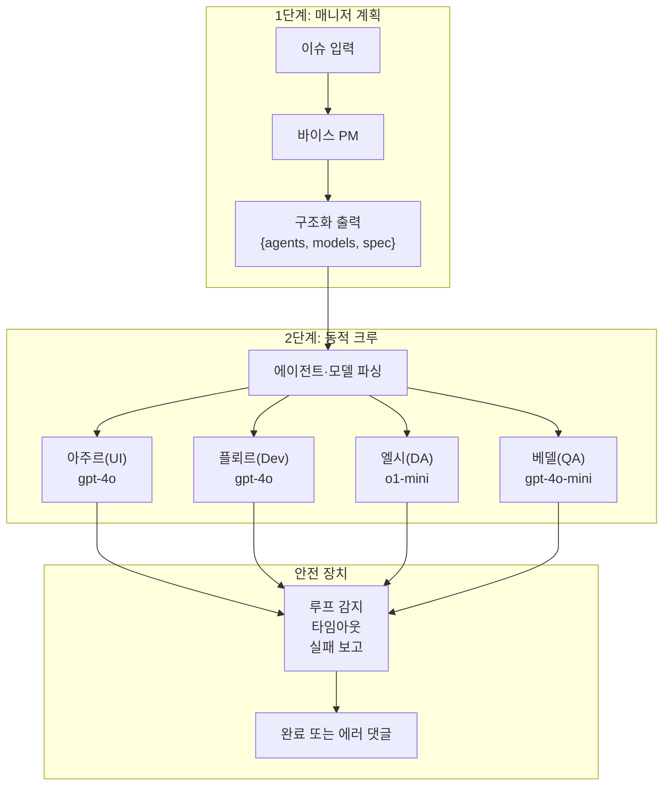

# 프로세스 강화 계획: 동적 에이전트 위임 구조

에이전트 팀을 고정 순차 파이프라인에서 **매니저 주도의 동적 위임 구조**로 전환하기 위한 계획.

**참조**: [docs/agent-convention.md](../agent-convention.md) — docs/plan, docs/skill, docs/issues 사용 규칙.

---

## 현재 구조 요약

- **진입점**: `main.py` — 고정 에이전트(매니저→아주르→플뢰르→엘시→베델), 고정 태스크, `Process.sequential`.
- **LLM**: `agents/agents.py` — 전역 단일 `LLM(model="openai/gpt-4o")`.
- **에이전트 팀**: 바이스(PM) / 아주르(UI Design+Pub) / 플뢰르(Dev) / 엘시(Devil's Adv.) / 베델(QA+UX)
- **한계**: 이슈 유형과 무관하게 항상 모든 에이전트가 순서대로 실행됨. 단순 버그 수정에도 UI 에이전트가 호출됨.

---

## 목표

1. **동적 에이전트 위임**: 각 에이전트가 필요할 때 다른 에이전트를 호출하거나 업무를 위임할 수 있는 구조
2. **매니저 주도 팀 구성**: 매니저(바이스)가 이슈를 분석하여 필요한 에이전트만 선발해 팀을 꾸림
3. **에이전트별 LLM 선택**: 역할·난이도에 따라 각 에이전트가 적절한 LLM 모델을 사용
4. **루프 방지 및 안전 중단**: 프로세스 도중 문제 발생 시 무한 루프를 방지하고 올바르게 종료

---

## 1. 매니저 주도 동적 팀 구성

### 구조

```
1단계: 매니저 단독 실행
  └─ 이슈 분석 + 기술 스펙 작성
  └─ 구조화 출력: { "agents": ["azure", "dev", "qa"], "reason": "..." }

2단계: 동적 크루 구성 및 실행
  └─ 1단계 출력에서 에이전트 목록 파싱
  └─ Crew(agents=selected, tasks=selected_tasks, process=sequential) 실행
```

### 구현 방향

- `main.py`의 `process_issue()`를 2단계로 분리
  - `_run_manager_planning(issue_number)` → 매니저만 실행, 에이전트 목록 JSON 반환
  - `_run_dynamic_crew(issue_number, selected_agents)` → 선발된 에이전트만 크루 실행
- `tasks/tasks.py`의 `create_*_task` 함수들을 에이전트 ID → 태스크 생성 함수 매핑 딕셔너리로 관리
- 매니저 출력 파싱 실패 시 폴백: 기본 에이전트 세트(dev + qa)로 실행

### CrewAI 옵션

| 방식 | 설명 | 적합성 |
|---|---|---|
| `Process.sequential` (2단계) | 매니저 1단계 후 동적 크루 재구성 | ✅ 기존 규칙(댓글 필수 등) 유지 가능 |
| `Process.hierarchical` | manager_agent가 내부적으로 위임 | ⚠️ 댓글 필수 같은 명시적 규칙 관리 어려움 |

**권장**: 명시적 2단계 방식. `Process.hierarchical`은 추후 검토.

### 난이도: 높음

---

## 2. 에이전트별 LLM 선택

### 구조

각 에이전트의 역할 특성에 맞게 LLM을 다르게 지정한다.

```python
# agents/agents.py 개편 방향
llm_strong  = LLM(model="openai/gpt-4o")         # 판단·설계 필요 역할
llm_fast    = LLM(model="openai/gpt-4o-mini")    # 단순 작업·빠른 응답 필요 역할
llm_reason  = LLM(model="openai/o1-mini")        # 논리적 추론 필요 역할 (엘시 등)
```

| 에이전트 | 기본 권장 모델 | 이유 |
|---|---|---|
| 바이스 (PM) | `gpt-4o` | 복잡한 판단, 에이전트 선발 |
| 아주르 (UI) | `gpt-4o` | 디자인 기획 + 코드 생성 |
| 플뢰르 (Dev) | `gpt-4o` | 코드 구현 품질 |
| 엘시 (Devil's Adv.) | `o1-mini` 또는 `gpt-4o` | 논리적 비판·추론 |
| 베델 (QA) | `gpt-4o-mini` | 체크리스트 검토, 비용 절감 |

### 구현 방향

- `agents/agents.py`에서 에이전트별 LLM 인스턴스 분리
- `.env`에 모델 후보 등록 (`OPENAI_MODEL_STRONG`, `OPENAI_MODEL_FAST` 등)
- 매니저 1단계에서 에이전트별 모델을 함께 지정하는 방향으로 확장 가능
- **gpt-5.3-codex 추후 검토**: 2026-02 출시, 코딩 에이전트 특화 모델이나 현재 Responses API 전용으로 CrewAI/LiteLLM(Chat Completions 기반)과 호환 불가. LiteLLM의 Responses API 지원 또는 OpenAI의 Chat Completions 개방 시 플뢰르·아주르에 우선 도입 검토.

### 난이도: 낮음~중간

---

## 3. 루프 방지 및 안전 중단

### 문제 유형

- **에이전트 루프**: 에이전트가 툴 호출 실패를 반복하며 무한 재시도
- **크루 루프**: 태스크 결과가 불완전해 CrewAI가 같은 태스크를 재실행
- **댓글 중복**: 같은 이슈에 동일 에이전트가 댓글을 여러 번 작성

### 방어 전략

```
1. 태스크 레벨: max_iterations 설정
   Agent(..., max_iter=5)  # 기본값 25 → 5로 제한

2. 크루 레벨: 타임아웃 및 최대 실행 횟수
   Crew(..., max_rpm=10)  # 분당 최대 요청 제한

3. 프로세스 레벨: 실행 감시 래퍼
   - process_issue() 전체를 try/except로 감싸 예외 시 이슈에 실패 댓글 작성
   - 실행 시간 상한선 설정 (예: 10분 초과 시 강제 종료)

4. 댓글 중복 방지
   - 이슈 댓글 작성 전 기존 댓글에 동일 에이전트 헤더가 있는지 확인
   - get_github_issue로 먼저 읽고 이미 댓글이 있으면 추가 작성 생략

5. 실패 시 보고
   - 크루 실행 실패 시 이슈에 "[시스템] 에이전트 실행 실패: {reason}" 댓글 자동 작성
   - agent-error 라벨 추가 (선택)
```

### 구현 방향

- `main.py`의 `process_issue()`에 `try/except` + 타임아웃 래퍼 추가
- `Agent` 생성 시 `max_iter=5` 기본 지정 (`agents/agents.py`)
- `tools/github_tools.py`의 `CommentIssueTool`에 중복 댓글 감지 옵션 추가

### 난이도: 중간

---

## 구현 우선순위

| 순위 | 항목 | 이유 |
|---|---|---|
| **1** | 에이전트별 LLM 분리 | 변경 범위 최소, 즉각 효과. `agents.py`만 수정. |
| **2** | 루프 방지 및 안전 중단 | 현재 구조에서도 즉시 적용 가능. 안정성 확보. |
| **3** | 매니저 주도 동적 팀 구성 | 효과 가장 크지만 변경 범위 최대. 1·2번 완료 후 진행. |

---

## 목표 구조 다이어그램


